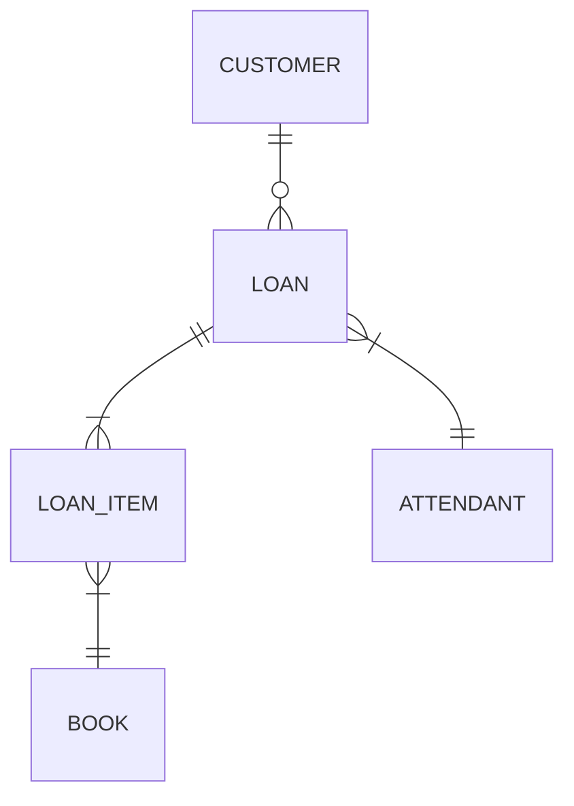
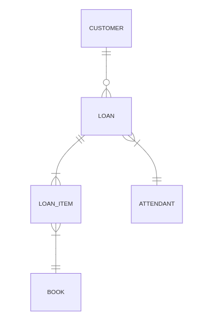

# Performance: Problemas de consultas N+1
> O problema de consultas N+1 ocorre quando para cada linha retornada em uma consulta inicial (à um banco de dados sql por exemplo) sua aplicação necessita realizar uma segunda consulta para recuperar dados adicionais de uma outra tabela. 

---

Para exemplificar este problema gerei 5 cenários para testes com diferentes implementações.
  
Todas utilizando o mesmo modelo de banco de dados e a mesma massa de dados.

  
*Apesar dos testes focados em Spring e JPA, 
as técnicas se aplicam à outras linguages/frameworks*

___

## Cenário Base: 

<!-- 

-->



---

## Cenário Base: 

- A base de dados está populada com:
  - 2 attendants
  - 50 books
  - 10 customers
  - cada customer 5 loan_items
- Será construida um API em cada cenário que deve retornar os customers com seu respectivos loan_items/books:  

---

exemplo:
```ts
[
  custumer {
    finstName :string ,
    lastName :string ,
    loanedBooks: [
        {
            bookId :UUID,
            bookName :string,
            bookDescription :string,
            loanDateTime :DateTime
        },
        // ...
    ]
  },
  //...
]
```

___

## Cenário 1 (COMO **NÃO** FAZER)

Neste cenário (como **não** fazer) o model/entity está exposto, sendo serializado para json e retornado diretamente em uma List.

<!-- ---

##### Cenário 1 (COMO **NÃO** FAZER)  -->

```java
@RestController
@RequiredArgsConstructor
public class CustomersRestController {
    
    private final CustomersHandler customersHandler;

    @GetMapping("report")
    public List<Customer> getCustomers() {
        return customersHandler.getCustomers();   
    }
}
```

---

requisição full gerou:

- 33 selects

requisição page-size=5:

- Não aplicável, neste caso seria usada a chamada full com 33 selects

---

#### Pontos negativos:

- Exposição da entidade/model em API publica
  - Expõe detalhes da implementação interna, dificultando evoluções internas
  - Quando o objeto é serializado ele fará o fetch de campos que estejam marcados como Lazy
- Busca não paginada - é feito um findAll pegando todos os itens na tabela

___

## Cenário 1B - Relecionamento circular

Neste cenário complementar, eu adicionei uma mudança que provocará um erro.

```java
public class Loan {
/* ... outros campos */
    @ManyToOne(fetch = FetchType.LAZY)
    @JoinColumn(name="attendant_id", insertable = false, updatable = false)
    private Attendant attendant;
}
```

```java
public class Attendant {
/* ... outros campos */
    @OneToMany()
    @JoinColumn(name="attendant_id", insertable = false, updatable = false)
    private Set<Loan> loans;
}
```

---
curl: 
```bash
$ curl localhost:8081
  ... }}]}]{"timestamp":"2023-01-11T20:45:01.244+00:00","status":200,"error":"OK","path":"/"}
  
  curl: (18) transfer closed with outstanding read data remaining


```
Logs da aplicação:
```bash
WARN .w.s.m.s.DefaultHandlerExceptionResolver : Failure while trying to resolve 
exception [org.springframework.http.converter.HttpMessageNotWritableException]

java.lang.IllegalStateException: Cannot call sendError() after the response has 
been committed
...
```

---

O que ocorre neste caso é que a serialização para string/json entre em um loop infinito, causado pelo relacionamento circular entra até esgotar os recursos e gerar um erro.  
  
  
Obs: se pelo menos um dos mapeamentos possuir FetchType.LAZY e não ocorrer um acesso recursivo (como é o caso da serialização para json), este erro não se manifestará.

___

## Cenário 2

Técnicas: uso de Dto e paginação

requisição full gerou:

- 31 selects

requisição page-size=5 gerou:

- 17 selects

---

### Mudanças:

```java
@RestController
@RequiredArgsConstructor
public class CustomersRestController {
    
    private final CustomersHandler customersHandler;

    @GetMapping("report")
    public Page<CustomerReportDto> getCustomers(Pageable pageable) {
        return customersHandler.getCustomers( pageable );
    }
}
```

---

```java
@Component
@RequiredArgsConstructor
public class CustomersHandler {

    private final CustomerRepository customerRepository;

    public Page<CustomerReportDto> getCustomers(final Pageable pageable) {
        return customerRepository.findAll(pageable)
            .map(this::convert);
    }

    private CustomerReportDto convert(final Customer customer) {

        final Set<LoanedBookDto> loanedBook = customer.getLoans().stream()
            .map(loan -> loan.getLoanItens())
            .flatMap(List::stream)
            .map(LoanedBookDto::from)
            .collect(toSet());

        return CustomerReportDto.from(customer, loanedBook);
    }
}
```

---

#### Pontos positivos:

- Modelo não fica exposto
- Possibilidade de fazer buscas paginadas, com maior controle de IO

#### Pontos negativos:

- Maior complexidade para fazer parsing/conversão de entidade para DTO

___

## Sobre FetchType (LAZY, EAGER)

Antes de ir para o próximo cenário, vamos falar de fetch types.
O FetchType default depende da cardinalidade do relacionamento:

- toOne:  FetchType.EAGER
- toMany: FetchType.LAZY

```java
public class LoanItem {
    /* ... */
    @ManyToOne(fetch = FetchType.LAZY)
    @JoinColumn(name="book_id", insertable = false, updatable = false)
    private Book book;
}
```

---

### selects gerados com FetchType.EAGER:

```sql
select loan_item.loan_id -- ... outros campos de loan_item
       book.id -- ... outros campos de book
from loan_item
left outer join book on loan_item.book_id=book.id
where loan_item.loan_id=?
```

---

### selects gerados com FetchType.LAZY:

```sql
select loan_item.loan_id -- ... outros campos de loan_item
from loan_item
where loan_item.loan_id=?
```

Mas se você acessar o item relacionando, um novo select será realizado

```sql
select book.id -- ... outros campos de book
from book
where book.id=?
```

___

## Cenário 3

Técnicas: adicionando FetchType.LAZY em todos os relacionamentos

requisição full gerou:

- 81 selects

requisição page-size=5 gerou:

- 42 selects

---

#### Pontos negativos:

- Mesma complexidade do cenáio 2 na questão: parsing/conversão de entidade para DTO
- Aumento na quantidade de queries 

___

## Cenário 4

Técnicas: Query JPQL com Projection

requisição full gerou:

- 11 selects

requisição page-size=5 gerou:

- 7 selects

---

### Mudanças:

Usando DTO como projection...
adicionado metodo em LoanItemRepository: 

```java
@Query("SELECT new com.example.demo.a.dto.LoanedBookDto(" + 
       "  b.id, b.name, b.description, li.createdAt " +
       ") " +
       "FROM LoanItem li " +
       "JOIN li.book b " +
       "WHERE li.customerId = :customerId")
Set<LoanedBookDto> findAllByCustomerId(@Param("customerId") UUID customerId);
```

---

Ou usando interface como projection...

nova interface criada:

```java
public interface ILoanedBookDto {
    UUID getBookId();
    String getBookName();
    String getBookDescription();
    LocalDateTime getLoanDateTime();
}
```

adicionado metodo ao repository: 

```java
@Query("SELECT " + 
       "  b.id as bookId, " + 
       "  b.name as bookName, " + 
       "  b.description as bookDescription, " + 
       "  li.createdAt as loanDateTime " +
       "FROM LoanItem li " +
       "JOIN li.book b " +
       "WHERE li.customerId = :customerId")
Set<ILoanedBookDto> findAllByCustomerIdToInterface(
                            @Param("customerId") UUID customerId);
```

---

#### Pontos positivos:

- Não há necessidade de parsing/conversão de entidade para DTO programaticamente
- Redução significativa de queries 
- Redução significativa de IO (apenas campos realmente usados são obtidos)

#### Pontos negativos:

- Implementação/manutenção de query
- Alguns erros na query só são detectados em runtime ***
- Apesar da redução nas queries ainda há N+1 (quantidade de queries aumento com quantidade de itens [Customer])

___

## Cenário 5

Técnicas: [Identity Map Pattern](https://martinfowler.com/eaaCatalog/identityMap.html) + JPQL + Projection

Neste cenário, no lugar de fazer uma busca dentro da iteração,
é feita uma busca prévia do tipo *SELECT ... WHERE **IN** (?)*
que é então cacheada em um Map (o identity map) agrupados por Custome.id.

---

requisições full e size=5 geram:

- **2 selects** 


---

### Mudanças:

```java
@Component
@RequiredArgsConstructor
public class CustomersHandler {

    private final CustomerRepository customerRepository;

    private final LoanItemRepository loanItemRepository;

    public Page<CustomerReportDto> getCustomers(final Pageable pageable) {
        final Page<Customer> customersPage = customerRepository.findAll(pageable);
        final Set<UUID> customersIds = customersPage.map(Customer::getId).toSet();
        final var loanedBooks = fetchLoanedBooks(customersIds);
        return customersPage.map( customer -> build(customer, loanedBooks));
    }

    private CustomerReportDto build(final Customer customer,
                                    final Map<UUID, List<ILoanedBookDto>> loanedBooks) {
        final List<ILoanedBookDto> customerLoanedBooks = loanedBooks
            .getOrDefault(customer.getId(), List.of());
        return CustomerReportDto.from(customer, customerLoanedBooks);
    }

    private Map<UUID, List<ILoanedBookDto>> fetchLoanedBooks(final Set<UUID> customersIds) {
        return loanItemRepository.findAllByCustomerIds(customersIds)
            .stream()
            .collect(groupingBy(ILoanedBookDto::getCustomerId));
    }
}
```

---

#### Pontos positivos:

- Não há necessidade de parsing/conversão de entidade para DTO programaticamente
- Redução de queries para 2 (independentemente da quantidade de itens) 

#### Pontos negativos:

- Implementação/manutenção de query
- Alguns erros na query só são detectados em runtime ***
- Maior complexidade no código

---

## Resumo

| **Cenário** | **Técnica** | **selects N=10** | **selects N=5** | **N+1?** |
| --- | --- | --- | --- | --- |
|1|                          | 33 | 33 | sim |
|2| DTO + Paginação          | 31 | 17 | sim |
|3| DTO + Paginação + FetchType.LAZY em todos os relacionamento| 81 | 42 | sim |
|4| DTO + Paginação + Projections | 11 | 7 | sim |
|5| DTO + Paginação + Projections + Identity Map | 2 | 2 | não |

--- 

### Complementos

**não** use:
```java
List list = repository.findAll();
// List list = repository.findAllByField();
if ( list.size() > 0 ) { /*...*/}
```

use:
```java
Boleean exists = repository.exists();
//Boleean exists = repository.existsByField();
if ( exists ) { /*...*/}
```

---

### Complementos

**não** use:
```java
List list = repository.findAll();
// List list = repository.findAllByField();
Long size = list.size();
```

use:
```java
Long size = repository.count();
//Long size = repository.countByField();
```

---

?

---

obrigado!

---

referências e outras leituras:  
- https://thorben-janssen.com/entity-mappings-introduction-jpa-fetchtypes/
- https://thorben-janssen.com/spring-data-jpa-dto-native-queries/
- https://thorben-janssen.com/jpql/
- https://docs.oracle.com/cd/E11035_01/kodo41/full/html/ejb3_langref.html
- https://martinfowler.com/eaaCatalog/identityMap.html